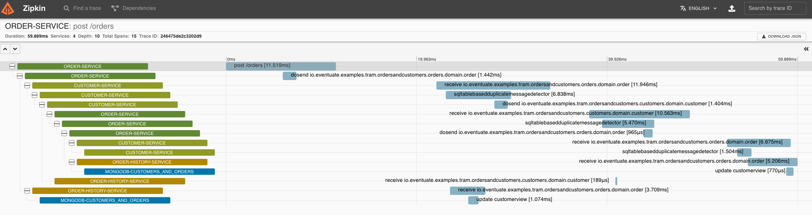

= Eventuate Tram - Spring Cloud Sleuth Integration

This repository defines modules that enable Spring Cloud Sleuth to capture Eventuate Tram message flows.

= An Eventuate project

image::https://eventuate.io/i/logo.gif[]

This project is part of http://eventuate.io[Eventuate], which is a microservices collaboration platform.

